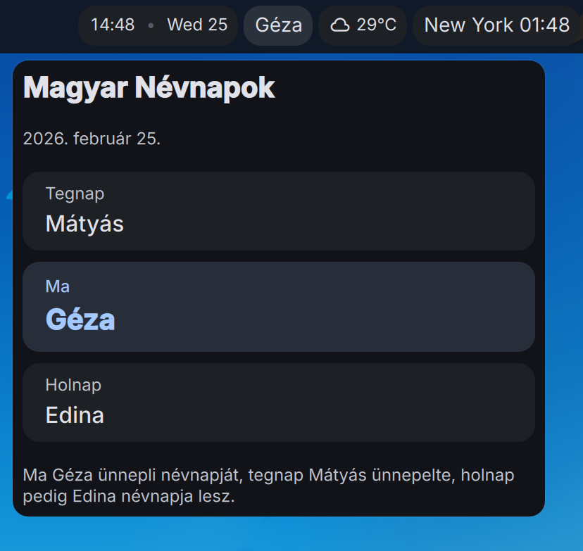

# Magyar Névnapok — DankMaterialShell Plugin

Display the current Hungarian nameday on the DankBar.



## Features

- Shows today's nameday name(s) on the bar pill
- Hover tooltip with yesterday/today/tomorrow namedays
- Click popout panel with a nice card layout for all three days
- No network requests — all 366 days embedded in the plugin
- Updates automatically at midnight via SystemClock

## Installation

Copy to your DMS plugins directory:

```sh
cp -r . ~/.config/DankMaterialShell/plugins/magyarNevnapok
```

Then restart DMS:

```sh
dms restart
```

## Data Source

Nameday data based on [sbolch/name-days](https://github.com/sbolch/name-days) (MIT license), with corrections to February 25–28 (upstream duplicates Mátyás on Feb 24–25, shifting subsequent days).

## License

MIT
